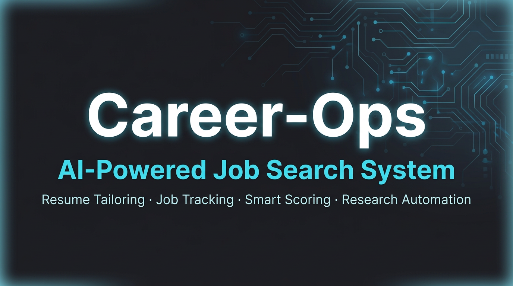

# Career-Ops

[English](README.md) | [Português](README.pt.md)

<p align="center">
  <a href="https://github.com/Wancoe/career-ops-template"></a>
</p>

<p align="center">
  Career-Ops is a local career workflow toolkit for evaluating jobs, scanning job boards, and tracking applications through terminal scripts and markdown files.
</p>

<p align="center">
  
  
  
  
  <br>
  
  
</p>

---

## What is Career-Ops?

Career-Ops is a standalone repository for managing a job search workflow. It helps you:

- Evaluate job opportunities with structured A-F scoring
- Scan configured job portals and collect new listings
- Track applications and evaluation reports in Markdown
- Assist with live application forms and LinkedIn outreach
- Run batch workflows and integrity checks locally

This project is maintained in `Wancoe/career-ops-template` and is designed for local use — no external hosted service required.

## Features

- **Job evaluation** — structured multi-block scoring (match, comp, culture, red flags)
- **Auto-pipeline** — paste a URL or JD and get a full evaluation + report + tracker entry
- **Portal scanning** — driven by `portals.yml` with 45+ pre-configured companies
- **Batch processing** — parallel headless evaluation of multiple offers
- **LinkedIn outreach** — find contacts and draft personalized messages
- **Deep research** — in-depth company research before applying
- **Interview prep** — company-specific guides and STAR story bank
- **Live apply assistant** — fills application forms, stops before Submit
- **Tracker management** — merge, dedup, normalize, and validate scripts
- **Dashboard** — Go-based terminal UI to visualize your pipeline
- **Local-first** — all data stays in your repository

## Quick start

```bash
# Clone the repository
git clone https://github.com/Wancoe/career-ops-template.git
cd career-ops-template
npm install
npx playwright install chromium

# Configure the project
cp config/profile.example.yml config/profile.yml
cp templates/portals.example.yml portals.yml

# Create your CV
# - cv.md: your resume in Markdown
# - article-digest.md: optional proof points and project notes

# Verify setup
npm run doctor
```

## Usage

### Evaluate a job offer

Paste a job URL or JD text into the AI assistant — it runs the full auto-pipeline:
evaluate → save report → draft application answers (if score ≥ 4.5) → update tracker.

For evaluation only: read `modes/oferta.md`.

### Manage the tracker

```bash
node merge-tracker.mjs       # Merge batch TSV additions into applications.md
node normalize-statuses.mjs  # Enforce canonical statuses
node dedup-tracker.mjs       # Remove duplicate entries
node verify-pipeline.mjs     # Pipeline health check
```

### Scan portals

Edit `portals.yml` with your target companies and search queries, then run the scan mode.

### Batch processing

Add URLs to `data/pipeline.md` and process them in bulk via `/career-ops pipeline` or `/career-ops batch`.

## Commands

| Command | What it does |
|---------|-------------|
| `/career-ops {JD or URL}` | Auto-pipeline: evaluate + report + tracker |
| `/career-ops oferta` | Evaluate a single offer (A-F scoring) |
| `/career-ops ofertas` | Compare and rank multiple offers |
| `/career-ops pipeline` | Process pending URLs from `data/pipeline.md` |
| `/career-ops scan` | Scan portals for new listings |
| `/career-ops batch` | Batch evaluate with parallel workers |
| `/career-ops contacto` | Find LinkedIn contacts + draft outreach |
| `/career-ops deep` | Deep company research |
| `/career-ops interview-prep` | Company-specific interview prep |
| `/career-ops apply` | Live application assistant |
| `/career-ops tracker` | Application status overview |

## Project structure

```
career-ops/
├── config/          # profile.yml — your identity and targets
├── data/            # applications.md, pipeline.md, scan-history.tsv
├── dashboard/       # Go TUI for pipeline visualization
├── docs/            # Architecture, setup, and reference docs
├── examples/        # Sample reports and fixtures
├── interview-prep/  # Story bank and company-specific prep files
├── jds/             # Saved job descriptions
├── modes/           # AI instruction files per command
├── output/          # Generated files (gitignored)
├── reports/         # Evaluation reports
├── templates/       # states.yml, portals.example.yml
└── batch/           # Batch runner and prompt
```

## Documentation

- Full CLI guide: [`CLI_GUIDE.md`](CLI_GUIDE.md)
- Quick reference: [`QUICK_REFERENCE.md`](QUICK_REFERENCE.md)
- Portuguese CLI guide: [`CLI_GUIDE_PT.md`](CLI_GUIDE_PT.md)
- PT-BR quick guide: [`GUIA_SIMPLES_PT.md`](GUIA_SIMPLES_PT.md)
- Architecture: [`docs/ARCHITECTURE.md`](docs/ARCHITECTURE.md)
- Data contract: [`DATA_CONTRACT.md`](DATA_CONTRACT.md)

## Disclaimer

Career-Ops is a local tool, not a hosted service.

- Your data stays on your machine and in your repository.
- Use job portals according to their terms of service.
- Evaluations are guidance, not guarantees.

See [LEGAL_DISCLAIMER.md](LEGAL_DISCLAIMER.md) for full details.

## License

MIT
